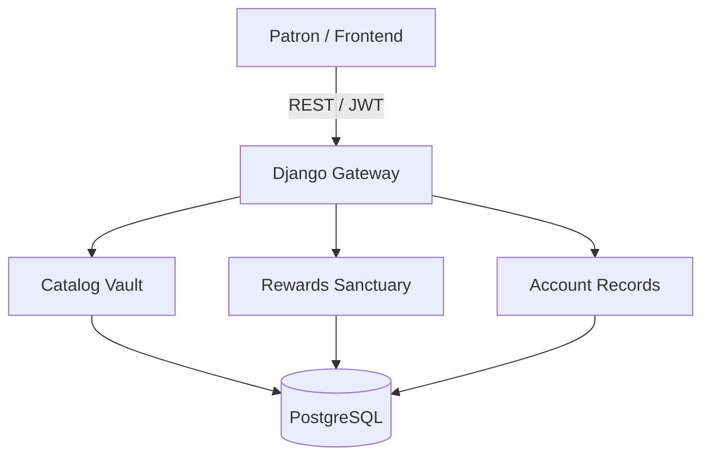

<p align="center">
  
</p>

<h1 align="center">🏛️ Heritage Brews: The Archival Sanctuary</h1>

<p align="center">
  <strong>A Museum-Grade E-Commerce Masterpiece celebrating the 130-Year Legacy of Indian Tea & Coffee.</strong>
  <br/>
  <em>"From the estates of India — Our Journey, Your Cup."</em>
</p>

<p align="center">
  
  
  
  
  
</p>

---

## 🌄 The Archival Vision

**Heritage Brews** is a digital sanctuary engineered to evoke the sensory weight of an antique Indian library. It represents a paradigm shift in e-commerce, where **High-Fidelity Interaction Design** meets **Archival Storytelling**. 

By blending cinematic aesthetics with a robust Django-powered backend, this project serves as a "Living Archive"—allowing patrons to not just purchase products, but to ascend through a royal lineage of tea mastery.

---

## 🎨 The Design Philosophy: "Obsidian & Gold"

Every pixel in the Sanctuary is governed by a strict **Design Codex** that prioritizes prestige, history, and visual depth.

### 🏛️ Visual Tokens
| Category | Specification | Designer Intent |
| :--- | :--- | :--- |
| **Foundation** | `#120e0a` (Deep Obsidian) | Evokes the quiet intensity of an ancient midnight study. |
| **Hallmark** | `#F4C430` (Royal Gold) | Represents the warmth of burnished brass and royal decrees. |
| **Surfaces** | `#1a1510` (Dark Walnut) | Provides a tactile, wood-grain depth to interactive cards. |
| **Typography** | *Noto Serif* & *Inter* | A dialogue between traditional calligraphy and modern data. |

### ✨ Interaction Specialties
- **High-Luminosity Glassmorphism**: Cards feature `backdrop-blur(24px)` and fine-rimmed golden borders, creating a "Museum Case" effect.
- **The Golden Sweep**: Hovering over interactive elements triggers a custom CSS `sweep` animation—a metallic flash that mimics light reflecting off polished gold.
- **Cinematic Depth**: Multi-layered radial gradients and inset vignettes ensure that focus is always directed towards the heritage content.

---

## 🍵 Key Full-Stack Hallmarks

### 👑 The Four Ascensions (Loyalty 2.0)
Patrons earn **Tea Tokens** for every interaction, progressing through four distinct tiers:
1. **Naya Patron**: The first step into the archive (0+ Tokens).
2. **Brass Baron**: A distinguished connoisseur (1,000+ Tokens).
3. **Heritage Keeper**: Guardian of the archival flushes (5,000+ Tokens).
4. **Maharaja**: The ultimate peak of connoisseurship (15,000+ Tokens).

### 🌿 The Alchemy of Six
An infinite-scroll marquee detailing the sacred journey of the leaf:
> *Katai (Harvest) → Murjhana (Wither) → Belan (Roll) → Khameer (Ferment) → Sukhana (Dry) → Chuna (Grade)*

### 🧑‍🍳 The Sommelier's Study
A curated space for the Master Blender, featuring:
- **Subscription Vaults**: High-fidelity cards for *Silver* and *Shahi Brass* tiers.
- **Archival Treasures**: A showcase of traditional artifacts like the *Brass Tea Canister* and *Terracotta Diya*.

---

## 🛠️ Archival Architecture

### 🧱 Structural Integrity
The system is built on a **Decoupled Architecture** for maximum performance and scalability.



### ⚡ Technical Specifications
- **Frontend**: Single Page Application (SPA) with **React 19** and **Vite**, optimizing for zero navigation latency.
- **Backend**: **Django REST Framework** with a custom **Loyalty Logic Engine** in the `UserProfile` model.
- **Seeding Intelligence**: A specialized `seed_catalog.py` script that calibrates the entire product ledger with a single command.

---

## 🚀 Getting Started

### 1. Secure the Perimeter
```bash
git clone https://github.com/your-username/heritage-brews.git
cd heritage-brews
```

### 2. Prepare the Backend Vault
The backend requires Python 3.10+ and a valid database connection.
```bash
cd backend
python -m venv venv
source venv/bin/activate  # On Windows: venv\Scripts\activate
pip install -r requirements.txt
python manage.py migrate
python manage.py seed_catalog  # CRITICAL: Inscribes the products & tiers
python manage.py runserver
```

### 3. Illuminate the Frontend
Ensure Node.js 18+ is installed in your workspace.
```bash
cd ..
npm install
npm run dev
```
Visit the Sanctuary at `http://localhost:5173`.

---

## 🗺️ The Archival Roadmap

- [x] **Phase I**: Core Sanctuary UI & Glassmorphism.
- [x] **Phase II**: Full-Stack Loyalty Integration (Four Ascensions).
- [x] **Phase III**: Archival Asset Migration (AI-Generated Hallmarks).
- [ ] **Phase IV**: AI-Powered Sommelier (Personalized Tea Recommender).
- [ ] **Phase V**: Global Export Ledger (International Shipping & Currencies).
- [ ] **Phase VI**: Interactive Estate VR (360° Tours of Heritage Estates).

---

## 🤝 The Archival Council (Contributing)

We welcome artisans, storytellers, and developers to contribute to the Heritage registers.
1. **Inscribe**: Fork the repository.
2. **Branch**: Create your masterpiece branch (`git checkout -b mastery/new-hallmark`).
3. **Incorporate**: Commit with descriptive, professional messages.
4. **Ascend**: Submit a Pull Request for peer review.

---

## 📜 The Royal Decree (License)

This archive is preserved under the **MIT License**.

---

<p align="center">
  
  <br/>
  <strong>Heritage Brews Archivists</strong><br/>
  <em>Preserving the taste of time, one flush at a time.</em>
</p>

<p align="center">
  Made with 🏛️, ☕, and ❤️ in India
</p>
