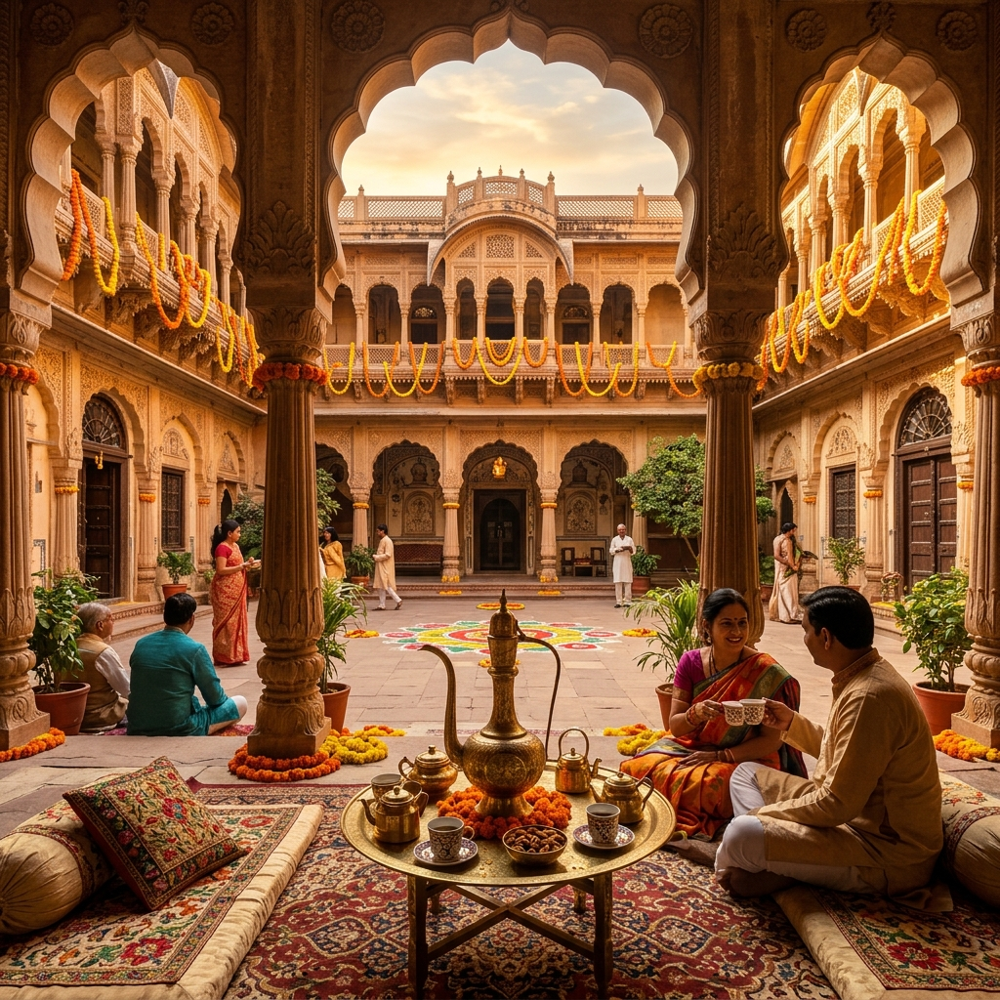
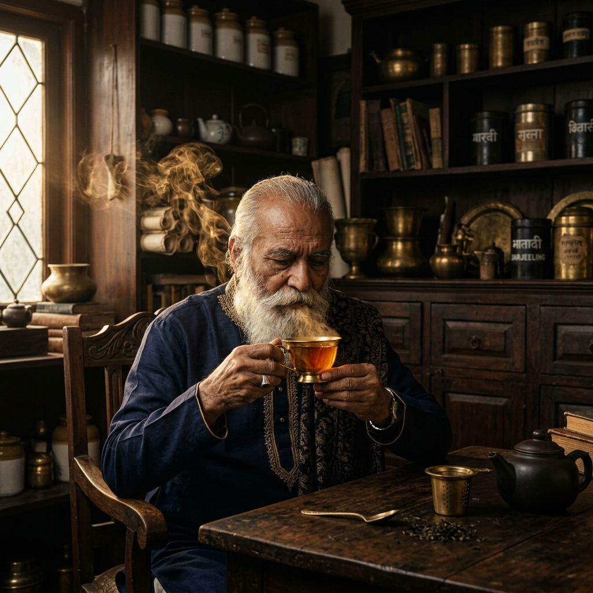
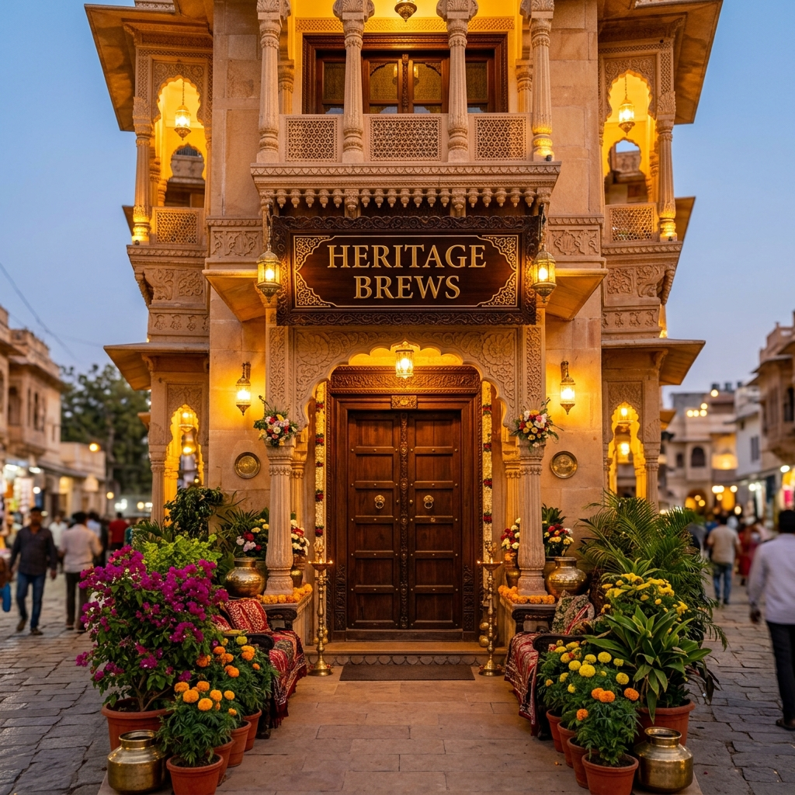

<p align="center">
  
</p>

<h1 align="center">☕ Heritage Brews</h1>

<p align="center">
  <strong>A Premium "Old-World Indian" Tea & Coffee E-Commerce Experience</strong>
  <br/>
  <em>Where every sip tells a story of 130 years of craft, from the misty hills of Darjeeling to the shade-grown estates of Coorg.</em>
</p>

<p align="center">
  
  
  
  
  
</p>

<p align="center">
  <a href="#-live-demo">Live Demo</a> •
  <a href="#-features">Features</a> •
  <a href="#-screenshots">Screenshots</a> •
  <a href="#️-tech-stack">Tech Stack</a> •
  <a href="#-getting-started">Getting Started</a> •
  <a href="#-project-structure">Project Structure</a> •
  <a href="#-design-system">Design System</a> •
  <a href="#-pages">Pages</a> •
  <a href="#-contributing">Contributing</a>
</p>

---

## 🌄 Overview

**Heritage Brews** is a fully hand-crafted, pixel-perfect, immersive front-end for a premium Indian tea & coffee brand. Inspired by the royal courts of Rajasthan, the misty tea estates of Darjeeling, and the ancient manuscript traditions of India — this project delivers an **experience**, not just a website.

Every page is designed with cinematic photography, heritage gold & espresso color tokens, glassmorphic plaques, ornate borders, and micro-animations that make the interface feel alive and deeply premium.

> *"We don't sell tea. We deliver heritage in a cup."*

---

## ✨ Features

### 🎨 Design & Aesthetics
| Feature | Description |
|---|---|
| **Dark Heritage Theme** | Deep espresso `#120e0a` background with heritage gold `#F4C430` accents across all pages |
| **Indian Block-Print Watermark** | A fixed, full-page traditional Mughal jaali pattern overlaid at ultra-low opacity |
| **Glassmorphic Plaques** | Text containers with frosted-glass effect, ornate double-borders, and deep shadows |
| **AI-Generated Imagery** | Every hero image and product photo is custom-generated for brand consistency |
| **Cinematic Vignettes** | Gradient overlays on hero sections for dramatic depth-of-field effects |

### ⚡ Interactions & Animations
| Feature | Description |
|---|---|
| **3D Flip Card** | The storefront image flips on click to reveal an antique map on the back |
| **Infinite Marquee** | "The Alchemy of Six" tea process steps auto-scroll infinitely; pause on hover |
| **Navbar Glassmorphism** | Slides down on load with a frosted-glass background and golden hover underlines |
| **Shimmer CTA Button** | Checkout button has a continuously animated golden shimmer sweep |
| **Hover Zoom on Images** | Subtle scale transforms on product and gallery images |
| **Interactive Map Pins** | Hover-to-reveal location labels on the vintage India map |

### 🛒 E-Commerce Features
| Feature | Description |
|---|---|
| **10 Full Pages** | Home, Menu, Estates, Sommelier, Chai Masala Builder, Gifts, Stories, Rewards, Checkout, Reservation |
| **Cart System** | React Context-powered cart with drawer UI |
| **Menu with Add-to-Cart** | Full categorized menu (Teas, Coffees, Snacks, Sweets) with pricing |
| **Subscription Tiers** | Silver & Shahi Brass subscription plans with feature comparison |
| **Checkout Flow** | Dark heritage checkout with delivery form, 4 payment methods, and order summary |

---

## 📸 Screenshots

### 🏠 Homepage — Royal Haveli Courtyard
<p align="center">
  
</p>

> The landing page features a vibrant Royal Indian Haveli courtyard with a glassmorphic Jharokha arch overlay, traditional block-print patterns, and a philosophy section styled as an ornate heritage plaque.

---

### 🍵 The Royal Menu
<p align="center">
  
</p>

> A cinematic close-up of steaming masala chai pouring from a vintage brass teapot. The menu body features categorized items with golden pricing, dark glass containers, and "Add to Cart" buttons with golden hover fills.

---

### 🌿 Crown Estates
<p align="center">
  
</p>

> A breathtaking panoramic view of misty tea estates at dawn with a majestic heritage mansion. Features an auto-scrolling "Alchemy of Six" marquee showing the tea-making process.

---

### 🧑‍🍳 The Sommelier's Selection
<p align="center">
  
</p>

> An atmospheric portrait of the tea master in his dimly lit study. Includes subscription tier comparison cards with golden borders and a curated box showcase with traditional Indian artifacts.

---

### 🏪 Heritage Brews Storefront — 3D Flip Card
<p align="center">
  
</p>

> Click to flip! The storefront photograph rotates in 3D to reveal an antique map of the city on the reverse side. Features CSS `perspective` and `backface-visibility` for a premium interaction.

---

### 🪔 Traditional Artisan Crafts
<p align="center">
  
</p>

> AI-generated traditional Indian terracotta diya lamp — one of the many custom assets created for the "Inside The Curated Box" section.

---

## 🛠️ Tech Stack

| Layer | Technology | Version |
|---|---|---|
| **Framework** | React | 19.2.4 |
| **Build Tool** | Vite | 8.0.4 |
| **Routing** | React Router DOM | 7.14.0 |
| **Styling** | TailwindCSS (CDN) + Vanilla CSS | 4.x |
| **Icons** | Google Material Symbols + React Icons | Latest |
| **Fonts** | Google Fonts (Noto Serif, Inter) | — |
| **State** | React Context API | Built-in |
| **Linting** | ESLint | 9.39.4 |
| **Node.js** | Node.js | 24.x |

---

## 🚀 Getting Started

### Prerequisites

- **Node.js** ≥ 18.x
- **npm** ≥ 9.x

### Installation

```bash
# 1. Clone the repository
git clone https://github.com/your-username/heritage-brews.git
cd heritage-brews

# 2. Install dependencies
npm install

# 3. Start the development server
npm run dev
```

The app will be running at **http://localhost:5173/**

### Build for Production

```bash
npm run build
npm run preview
```

---

## 📁 Project Structure

```
heritage-brews/
├── public/
│   └── images/                    # AI-generated & curated imagery
│       ├── royal_haveli_courtyard.png
│       ├── heritage_brews_exterior.png
│       ├── premium_menu_hero.png
│       ├── majestic_tea_estates.png
│       ├── master_sommelier.png
│       ├── indian_pattern.png     # Full-page watermark texture
│       ├── brass_tea_canister.png
│       ├── loose_tea_leaves.png
│       ├── terracotta_diya_lamp.png
│       ├── darjeeling_tea_*.png
│       ├── elaichi_chai_*.png
│       ├── monsoon_coffee_*.png
│       └── ... (24 total assets)
├── src/
│   ├── components/
│   │   ├── Navbar.jsx             # Glassmorphic animated navbar
│   │   ├── Navbar.css
│   │   ├── Footer.jsx             # Heritage-themed footer
│   │   ├── Footer.css
│   │   ├── CartDrawer.jsx         # Slide-out cart panel
│   │   └── CartDrawer.css
│   ├── context/
│   │   └── CartContext.jsx        # Global cart state management
│   ├── pages/
│   │   ├── Home.jsx               # Landing page with Haveli hero
│   │   ├── Menu.jsx               # Full categorized menu
│   │   ├── Estates.jsx            # Tea estate origins & process
│   │   ├── Sommelier.jsx          # Subscription & master blender
│   │   ├── ChaiMasala.jsx         # Interactive chai builder
│   │   ├── Gifts.jsx              # Gift boxes & hampers
│   │   ├── Stories.jsx            # Brand storytelling
│   │   ├── Rewards.jsx            # Loyalty program
│   │   ├── Checkout.jsx           # Order & payment flow
│   │   ├── Reservation.jsx        # Table booking
│   │   └── *.css                  # Page-specific styles
│   ├── App.jsx                    # Root with routing & providers
│   ├── main.jsx                   # Entry point
│   └── index.css                  # Global base styles
├── docs/                          # README screenshots
├── index.html                     # HTML shell with font imports
├── vite.config.js                 # Vite configuration
├── package.json                   # Dependencies & scripts
└── README.md                      # This file
```

---

## 🎨 Design System

### Color Palette

| Token | Hex | Usage |
|---|---|---|
| **Deep Espresso** | `#120e0a` | Primary background |
| **Dark Walnut** | `#1c1511` | Card/surface backgrounds |
| **Warm Umber** | `#2a201b` | Elevated containers |
| **Heritage Gold** | `#F4C430` | Headings, accents, CTAs |
| **Royal Crimson** | `#890000` | Highlight sections |
| **Parchment White** | `#e5e2d8` | Primary text |
| **Antique Tan** | `#c4b5a2` | Secondary/body text |

### Typography

| Role | Font | Weight | Style |
|---|---|---|---|
| **Headlines** | Noto Serif | 700 (Bold) | Normal & Italic |
| **Body** | Noto Serif | 400 (Regular) | Italic for descriptions |
| **Labels** | System Sans | 700 (Bold) | Uppercase, tracking-widest |

### Design Principles

1. **"No-Solid-Line" Philosophy** — Borders are always translucent (`border-[#F4C430]/20`) for a soft, royal feel
2. **Glassmorphism** — Frosted-glass containers with `backdrop-filter: blur(24px)` and semi-transparent backgrounds
3. **Cinematic Depth** — Multi-layer gradient overlays, inset vignette shadows, and deep box-shadows
4. **Heritage Patterns** — Fixed full-page Indian block-print watermark at 3% opacity using `mix-blend-mode: color-dodge`
5. **Golden Micro-Interactions** — Hover states use gold fills, scale transforms, and opacity transitions

---

## 📄 Pages

### Page Overview

| # | Route | Page | Description |
|---|---|---|---|
| 1 | `/` | **Home** | Hero with Haveli courtyard, philosophy section, 3D flip-card storefront |
| 2 | `/menu` | **Menu** | Categorized menu with Heritage Teas, Coffees, Snacks & Sweets |
| 3 | `/estates` | **Estates** | Tea origins, farmer profiles, auto-scrolling "Alchemy of Six" |
| 4 | `/sommelier` | **Sommelier** | Master blender profile, Silver & Shahi subscription tiers |
| 5 | `/chai-masala` | **Chai Masala** | Interactive chai spice builder/customizer |
| 6 | `/gifts` | **Gifts** | Curated gift boxes & heritage hampers |
| 7 | `/stories` | **Stories** | Brand storytelling & heritage chronicles |
| 8 | `/rewards` | **Rewards** | Loyalty tiers, points system, exclusive perks |
| 9 | `/checkout` | **Checkout** | Delivery form, 4 payment methods, shimmer CTA |
| 10 | `/reservation` | **Reservation** | Table booking at the Heritage Brews café |

---

## 🧩 Key Components

### `<Navbar />`
- Glassmorphic frosted-glass background
- Slide-down entrance animation on page load
- Golden hover underlines with 3D lift effect
- Integrated cart icon with item count badge

### `<CartDrawer />`
- Slide-out panel from the right
- Real-time item list with quantity controls
- Subtotal calculation
- "Proceed to Checkout" navigation

### `<Footer />`
- Heritage-themed with golden accents
- Quick navigation links
- Social media icons
- Brand tagline and copyright

---

## 🖼️ AI-Generated Assets

Every image in Heritage Brews is **custom AI-generated** to maintain perfect brand consistency. No stock photos were used.

| Asset | Description |
|---|---|
| `royal_haveli_courtyard.png` | Vibrant Indian Haveli with warm evening lighting |
| `heritage_brews_exterior.png` | Grand café entrance with "Heritage Brews" signage |
| `premium_menu_hero.png` | Steaming chai from a vintage brass teapot |
| `majestic_tea_estates.png` | Panoramic misty tea estates at golden dawn |
| `master_sommelier.png` | Cinematic portrait of the tea master sommelier |
| `indian_pattern.png` | Traditional Mughal block-print seamless texture |
| `brass_tea_canister.png` | Ornate hand-etched brass canisters on dark wood |
| `loose_tea_leaves.png` | Premium dried tea leaves with silver tips |
| `terracotta_diya_lamp.png` | Traditional diya oil lamp with warm golden flame |
| `dark_tea_mountains.png` | Tea garden mountains at dusk |
| `darjeeling_tea_*.png` | Darjeeling first flush tea product photo |
| `elaichi_chai_*.png` | Cardamom ginger chai product photo |
| `monsoon_coffee_*.png` | Monsoon Malabar AA coffee product photo |
| `awadhi_biryani_*.png` | Traditional biryani accompaniment |
| `shahi_samosa_*.png` | Royal samosa snack |
| `mathri_snack_*.png` | Traditional mathri cracker |

---

## ⚡ Performance Considerations

- **Local Image Assets** — All hero images served from `/public/images/` for instant loading
- **CSS Animations** — All animations use `transform` and `opacity` for GPU-accelerated compositing
- **Lazy Sections** — Content appears as you scroll via natural DOM rendering
- **Minimal JS** — Most visual effects achieved through pure CSS (no animation libraries)
- **Vite HMR** — Sub-second hot module replacement during development

---

## 🗺️ Roadmap

- [ ] **Mobile-First Navigation** — Hamburger menu implementation for screens < 768px
- [ ] **Cart Persistence** — LocalStorage integration for cart state across sessions
- [ ] **Payment Integration** — Razorpay/Stripe gateway for live transactions
- [ ] **CMS Backend** — Headless CMS for menu items and blog stories
- [ ] **User Authentication** — Account system for order history and loyalty rewards
- [ ] **Search & Filters** — Real-time menu filtering by category, price, and dietary preference
- [ ] **Order Tracking** — Live delivery status with animated progress UI
- [ ] **Dark/Light Toggle** — Switch between Heritage Dark and Parchment Light themes

---

## 🤝 Contributing

Contributions are welcome! Please follow these steps:

1. **Fork** the repository
2. Create a **feature branch** (`git checkout -b feature/amazing-feature`)
3. **Commit** your changes (`git commit -m 'Add amazing feature'`)
4. **Push** to the branch (`git push origin feature/amazing-feature`)
5. Open a **Pull Request**

### Code Style

- Use `dangerouslySetInnerHTML` for heritage-themed static sections
- Follow the Dark Heritage color palette strictly
- All new images should be AI-generated to maintain brand consistency
- Use `class` (not `className`) inside HTML template strings

---

## 📜 License

This project is licensed under the **MIT License** — see the [LICENSE](LICENSE) file for details.

---

## 🙏 Acknowledgments

- **Google Fonts** — Noto Serif typeface family
- **Google Material Symbols** — Icon library
- **TailwindCSS** — Utility-first CSS framework
- **Vite** — Next-generation frontend build tool
- **React** — UI component library

---

<p align="center">
  
  <br/><br/>
  <strong>Heritage Brews</strong>
  <br/>
  <em>"From the estates of India — Our Journey, Your Cup."</em>
  <br/><br/>
  Made with ☕ and ❤️ in India
</p>
